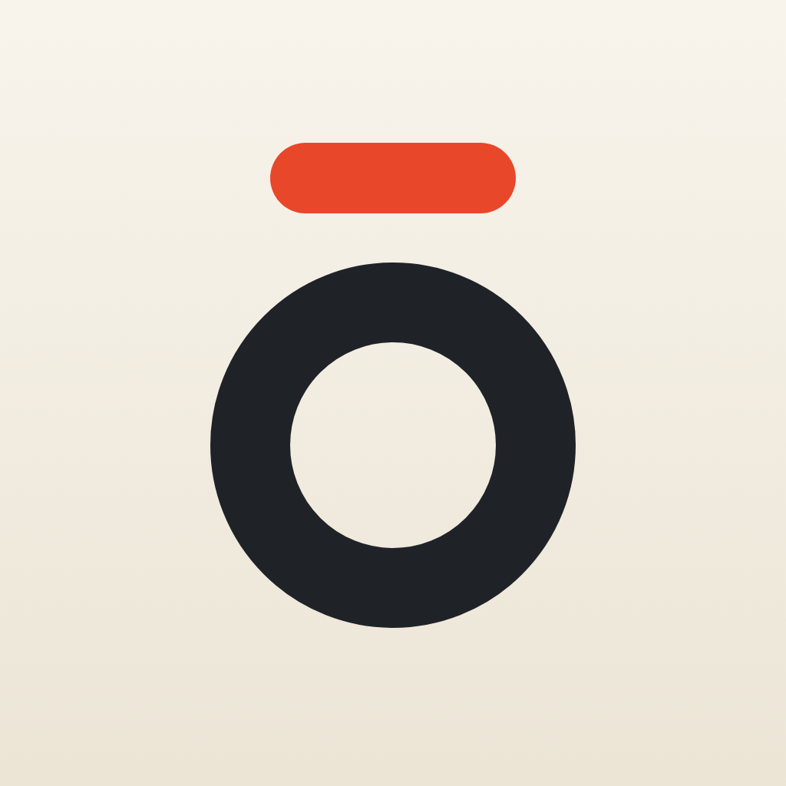

<p align="center">
  
</p>

<h1 align="center">Kyo</h1>

<p align="center">
  A daily planner for iPhone, iPad, and Apple Watch that shows one day at a time.
</p>

<p align="center">
  <a href="#download">Download</a> ·
  <a href="#what-kyo-does">Features</a> ·
  <a href="#build-from-source">Build from source</a> ·
  <a href="https://github.com/xchrisbailey/kyo/issues">Issues</a>
</p>

<p align="center">
  <a href="https://github.com/xchrisbailey/kyo/actions/workflows/ci.yml"></a>
  
  
  
</p>

Kyo (今日, "today") has no calendar grid, no backlog, and no projects. It opens on Today and stays there: what's on your calendar, what you mean to get done, the habits that are due, and the thoughts you captured along the way. Tomorrow starts fresh, with yesterday's unfinished tasks carried over.

## Download

Kyo is in beta on TestFlight. The beta isn't open to the public yet, so there's no install link to share. Until there is one:

- [Build it from source](#build-from-source) with Xcode. It takes a few minutes and needs no third-party dependencies.
- [Watch the repository](https://github.com/xchrisbailey/kyo/subscription) to hear when a public build is out.

Kyo needs iOS 27, iPadOS 27, or watchOS 27.

## What Kyo does

### Schedule

Today's events from the calendars already on your device, in a compact section at the top: all-day events on one line, then the next three timed events, with the rest a tap away. Tap an event to see its details. You choose which calendars appear, or turn the section off. Kyo only reads your calendars; it never changes them and never stores your events.

### Tasks

A plain list of things to do today. Type a task, press Return, and check it off when it's done. Finished tasks drop to the bottom. Whatever you don't finish carries forward to tomorrow on its own.

### Habits

Define a habit once and give it a schedule: every day, specific weekdays, or a number of times per week. Each day Kyo lists only the habits that are due. Rows show your streak, or your progress through the week (such as 2/3) for weekly targets. A missed habit never piles up on the next day.

### Memos

Capture a thought by typing it or saying it.

- **Voice memos** keep their audio and get a transcript as you speak. You can edit the transcript without touching the recording.
- **Photos**: attach up to four to any memo.
- **Memo → Task**: Kyo suggests tasks from what you wrote or said, and you pick which ones to add to Today.
- **History**: Today shows today's memos. Older ones are in a searchable history.

Transcription, memo titles, and suggested tasks all run on your device. Titles and suggested tasks need Apple Intelligence.

### Quick capture

Start a memo without opening the app first:

- a Control Center or Lock Screen control;
- the Action button;
- Siri and Shortcuts ("Record memo" and "Write memo");
- a complication on Apple Watch.

### Apple Watch

The Watch app shows Today's tasks, habits, and memos. You can add, edit, check off, and delete tasks, check off habits, and record voice memos from your wrist. Recordings are sent to your iPhone, which transcribes them, even if the phone was out of reach when you recorded.

## Privacy

Kyo has no account, no server, and no analytics. Your tasks, habits, and memos are stored on your devices, and your iPhone and Apple Watch sync directly with each other. Speech and AI features run on device.

Kyo asks for the microphone to record voice memos, the camera to take memo photos, and your calendars to show the Schedule. It asks for each one only when you first use that feature.

## Good to know

- iCloud sync isn't built yet, so an iPhone and an iPad each keep their own data. The storage is designed for it ([ADR 0004](docs/adr/0004-swiftdata-cloudkit-ready-storage.md)).
- The Schedule is on iPhone and iPad only.
- Kyo doesn't track food or nutrition, by design ([ADR 0006](docs/adr/0006-nutrition-out-of-scope.md)).

Planned work is in [Issues](https://github.com/xchrisbailey/kyo/issues). Next up is [collapsible sections](docs/specs/collapsible-sections.md).

## Build from source

You need Xcode 27 or later with the iOS and watchOS SDKs. Kyo is written in Swift 6 and has no third-party dependencies.

```sh
git clone https://github.com/xchrisbailey/kyo.git
cd kyo
open Kyo.xcodeproj
```

Pick the **Kyo** scheme with an iPhone or iPad simulator, or the **KyoWatch** scheme with an Apple Watch simulator, and run.

To run on your own devices, set your development team and bundle identifiers first. [docs/development.md](docs/development.md) covers that, along with the project layout, tests, CI, and TestFlight releases.

## Documentation

| | |
| --- | --- |
| [GLOSSARY.md](GLOSSARY.md) | The words Kyo uses, and what each one means. |
| [docs/specs](docs/specs) | How each feature is meant to behave. |
| [docs/adr](docs/adr) | Architecture decisions and the reasons behind them. |
| [docs/development.md](docs/development.md) | Building, testing, CI, and releasing. |
| [AGENTS.md](AGENTS.md) | How work is planned, delegated, and reviewed in this repository. |

## Feedback

Found a bug or have an idea? [Open an issue](https://github.com/xchrisbailey/kyo/issues/new).
